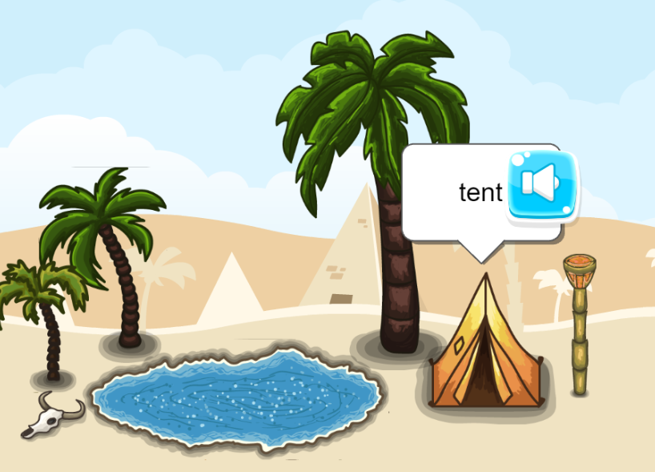
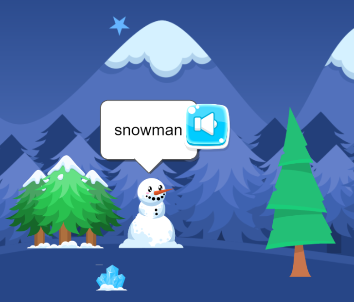
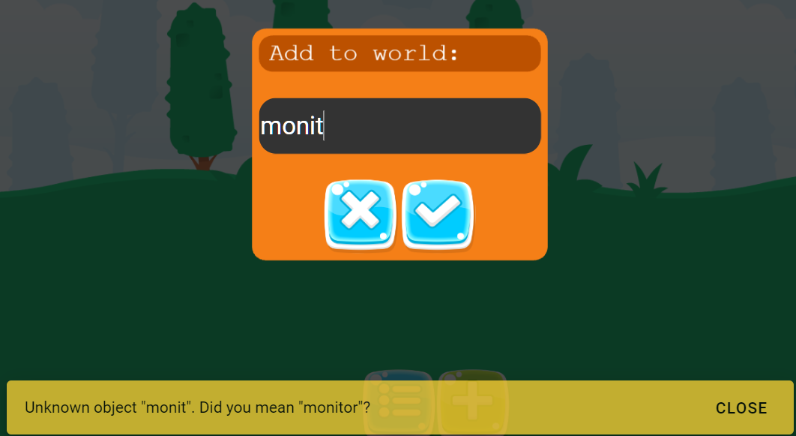
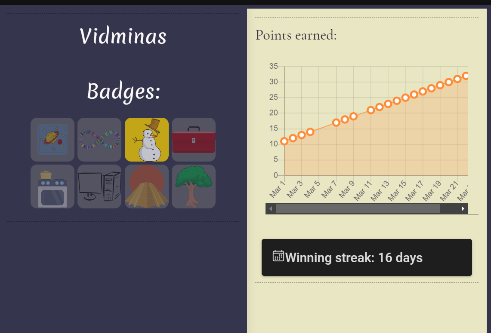

# Fill In The World client

Some screenshots from the application:

|                                              |                       |
| :----------------------------------------------------------------------------------------------------------------------------------------------------------: | :----------------------------------------------------------------------------------------------------------------------------------------: |
|  |  |

This is the client application for the following project:

# Exploring gamification techniques in children’s language learning (2020-21)

This is my final-year undergraduate dissertation project, supervised by Professor [Judy Robertson](https://www.ed.ac.uk/profile/judy-robertson), at the University of Edinburgh.

About the project:

## Principal goal

- Investigate how digital game elements in education can impact primary school learners’ engagement and how they can be implemented in practice

## Description

This project is focused on investigating how systems for games-based learning of computer science can be developed, the effectiveness of gamification elements and the challenges developers must overcome to implement them.

Games-based learning is using digital games together with traditional teaching practices in education. (AdvanceHE, 2017)

- An example of this in the UK is Sumdog - the company makes educational games for learning maths and spelling. The Sumdog January 2020 impact report claims that regular Sumdog users made double the progress over 1.5 years in maths fluency than non-regular users (Sumdog, 2020)

Gamification in education is using principles of game design in non-game contexts, such as learning exercises. (AdvanceHE, 2017)

- An example of this in New York City is a public school called Quest to Learn, where the study curriculum and assessments are all game-based. The teachers meet with game designers and curriculum designers every trimester to plan learning activities. The school boasts an average student attendance rate of 94%, and that they outperform other local schools: 54% of Q2L students passed the 2015 ELA exam, while the pass rate city-wide was only 30.4% (Quest to Learn, 2020)
  These examples show clear benefits of education that employs games-based learning. However, despite the benefits, such learning systems have not replaced traditional learning, and one of the main reasons is that they are time consuming and difficult to implement. And even then, they only target a specific target audience. (Dicheva et al., 2015)

There is a lot of literature about gamification, that could provide useful insights (Hamari, Koivisto and Sarsa, 2014). Furthermore, existing systems, such as Duolingo or Mondly would also be useful reference points for finding and summarising different elements of gamification.

### The key questions to investigate are

- How do elements of gamification (e.g. leaderboards, coins, points, badges, instant feedback, achievements, or others) impact learners’ engagement?
- How can elements of gamification be implemented (such that the implementation is accessible, with e.g. poor internet connection, low-end devices, limited technology)?

## Current project plan

1. ~~Choose a specific topic of learning~~ Chosen Lithuanian / English language learning
2. Examine existing literature in gamification and children’s learning of the topic, find a framework of gamification techniques
3. Choose a target audience age group
4. Evaluate existing language learning tools / apps / games
5. Come up with initial designs for a prototype. Include ideas how to leverage sound + visuals to support learning even if users don't have a primary language to rely on
6. In consultation with teachers and game designers, gather requirements for a prototype system to explore gamification techniques and refine designs
7. Submit an ethics proposal
8. Create a prototype mock-up (Figma or similar)
9. Interview teachers to gather feedback
10. Adjust designs with received feedback and implement a proof-of-concept web app
11. Evaluate system with groups of children to see the impact of gamification on children’s engagement with the topics, motivation, and self-efficacy
12. Improve or broaden scope of the system and repeat

### Completion criteria:

#### Easy:

The project will be complete when a prototype containing at least 3 principles of gamification has been evaluated with at least a small group (5 individuals) of members of the target user group.

#### Moderate:

The project is complete when at least 5 principles of gamification are implemented and evaluated with at least 3 cross-validated groups of at least 5 individuals, as well as with a control group. At least 1 feedback-development cycle should be completed.

#### Hard:

Different implementation approaches should be discussed, including research into feasibility of adopting the system in schools, costs and compatibility. The system should be compatible with multiple operating systems / devices.

#### Very hard:

An entire framework to facilitate development digital games for supporting learning could be developed.

### References

AdvanceHE. (2017). Gamification and Games-Based Learning | Higher Education Academy. [online] Available at: https://www.heacademy.ac.uk/knowledge-hub/gamification-and-games-based-learning [Accessed 17 Feb. 2020].

Dicheva, D., Dichev, C., Agre, G. and Angelova, G. (2015). Gamification in Education: A Systematic Mapping Study. Journal of Educational Technology & Society, [online] 18(3), p.1. Available at: https://www.jstor.org/stable/pdf/jeductechsoci.18.3.75.pdf [Accessed 27 Feb. 2020].

Hamari, J., Koivisto, J. and Sarsa, H. (2014). Does Gamification Work? -- A Literature Review of Empirical Studies on Gamification. 2014 47th Hawaii International Conference on System Sciences. [online] Available at: https://ieeexplore.ieee.org/document/6758978 [Accessed 20 Feb. 2020].

Quest to Learn. (2020). About Quest to Learn (Q2L) - Middle School and High School. [online] Available at: https://www.q2l.org/about/ [Accessed 17 Feb. 2020].

Sumdog. (2020). Impact Report: Maths Fluency - Sumdog. [online] Available at: https://pages.sumdog.com/pages/impact-report-maths-fluency/ [Accessed 20 Feb. 2020].
